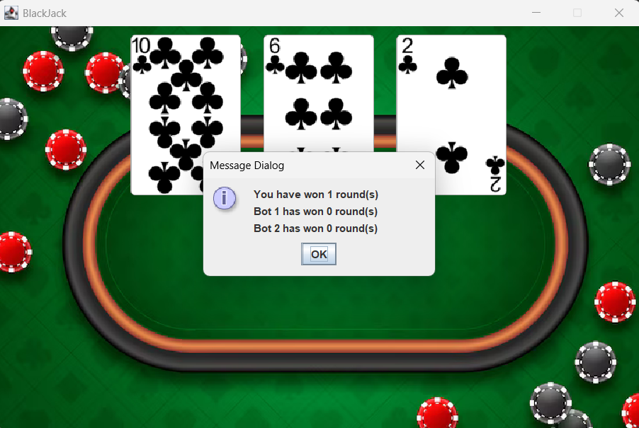

# BLACKJACK
Coding Challenge for the 2025 Summer Internship at PointClickCare

# DESCRIPTION
This Java-based program is a re-creation of the card game, BlackJack. 
The goal is to achieve a total value of 21 of all the cards in your hand, or obtain a higher total card value than the Dealer, while competing against a Dealer.
Its simple GUI allows the user to have a user-friendly experience.

# INSTRUCTIONS
When you first run the game, you will be at the Title Screen for 3 seconds. After that, you will be taken to the Main Game. You and 2 other Bots will be competing against the Dealer, individually.

You will be shown the Blackjack table and a card faced up. This card is the Dealer's first card. It then asks you to place a bet (if you type in anything other than a number or a negative number, it will ask you again). After placing your bet, you will see how much both the Bots bet (these values are randomized).

Afterwards, the game will how you the 2 cards that are in your hand. It will then calculate the total value of these cards in your hand (Cards 2-10 are scored using their face value, J,Q,K are scored a 10, and A can be scored at either a 1 or 11 (you can choose throughout the round)). If this total value equals 21, you WIN the round. You automatically win 1.5 times your original bet, and you don't have to continue playing the round anymore. The same process occurs for both the Bots.

After knowing both your cards, you will be asked if you want to HIT or STAY. If you click HIT, another card is added to your hand. However, it is your job to keep track of the new value of all the cards in your hand. You can pick up as many cards as you like, until you click STAY. Once you click STAY, both the Bots will choose to HIT (pick up a card) or STAY (end their turn). But this choice is randomized so that both the Bots are more likely to HIT than STAY. After your turn and the Bots' turns have ended, you will know your total value of all the cards in your hand, as well as the both the Bots' total values.

If this total value is greater than 21, you BUST. This means you lose the round and your entire bet goes to the Dealer. If it equals 21, then you WIN the round. You automatically win 2.5 times your original bet, and you don't have to continue playing the round anymore. If it is under 21, then you continue playing the round. The same process occurs for both the Bots. Afterwards, you will get updated on how much the Dealer accumulated from your turn and the Bots' turns.

Now it is the Dealer's turn. The Dealer reveals his second card in his hand, which you can see in the game. If the total value of both of the Dealer's cards is less than or equal to 16, then the Dealer picks up a third card, which you can see in the game. The Dealer now has a new total value of all 3 cards. If the Dealer's total card value is greater than 21, then the Dealer BUSTS. This means that you and the Bots (whoever is remaining in the round) all win the round, and also win twice their original bet.

Now that the Dealer's Turn is over, it's time to compare the total values of each player with the Dealer (if the Dealer didn't BUST already). If your total card value is less than the Dealer's total card value, then you LOSE the round and you lose your entire bet to the Dealer. If your total card value is greater than the Dealer's total card value, then you WIN the round and also twice your original bet. If your total card value is equal to the Dealer's total card value, then it's a TIE and no one wins/loses. The same process occurs between both the Bots and the Dealer.

The game is now over. It will show you your and the other Bots' current bet values. It will also how you how much the Dealer earned from the round.

The game will also display the number of rounds you and the Bots have won.

The game will ask if you want to play another round. If you click YES, everything is reset and you will play the whole game again. If you click NO, then you will be asked if you're sure that you want to exit. If you're sure and click YES, you exit the game. If you're unsure and click NO, then you will be asked if you want to play another round again. However, if you exit the game, the amount of rounds you won will be reset to 0. 

THANKS FOR PLAYING!!!
